

# MSI-H270-RX470_mod_570-Hackintosh

EFI H270 MSI Gaming M3 + Intel I5 7600 with OpenCore bootloader

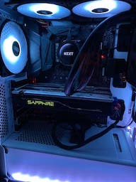

### Computer Spec:

| Component        | Brank                              |
| ---------------- | ---------------------------------- |
| CPU              | Intel i5 7600 (4C-4T 6MB)          |
| iGPU             | Intel® Graphics HD 630             |
| GPU              | RX 470/570 Sapphire Nitro+ 4g      |
| Audio            | Realtek ALC1220                    |
| Ram              | 16 GB DDR4 2400 Mhz                |
| Wifi + Bluetooth | Fenvi PCIe Wifi t919 1750 Mbps     |
| Lan              | Killer 2500 2.5G                   |
| Name             | Sabrent Rocket 256G.    ( MacOS )  |
| SSD              | SPCC Silicon Power 128G ( Win )    |
| HDD              | WD 2 Tera                          | 
| SmBios           | iMac 18,3                          |
| BootLoader       | OpenCore 0.6.7                     |
| macOS            | Big Sur 11.2.3                     |

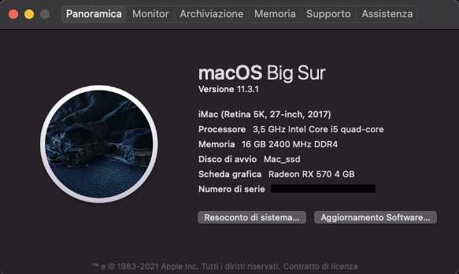

## Opencore (0.6.7) HakintoshLife

### What works and What doesn't or WIP:

- [x] CFG Unlock
- [x] Intel Graphics HD iGPU (use for task only)
- [x] ALC1220 All jack activate
- [x] ALC1220 Combo jack external
- [x] All USB-A 3.1 Ports (TYPE-C incluse)
- [x] SpeedStep / Sleep / Wake
- [x] HID Key PWRB & SLPB 
- [x] Wi-Fi and Bluetooth Fenvi T919
- [x] Controller SATA III 
- [x] All Sensors CPU, IGPU, GPU, NVME, SATA, FAN
- [x] NVRAM
- [x] Recovery (macOS) boot from OpenCore

## Full Native Network

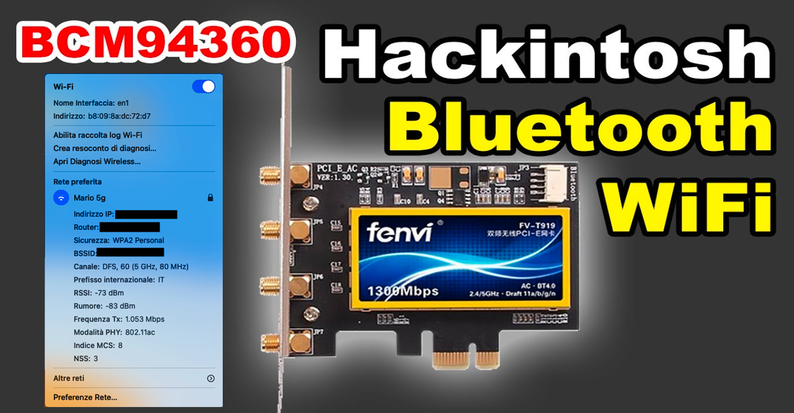

Full work AirPort - AirDrop - AirPlay

## Peripherals & Benchmarks

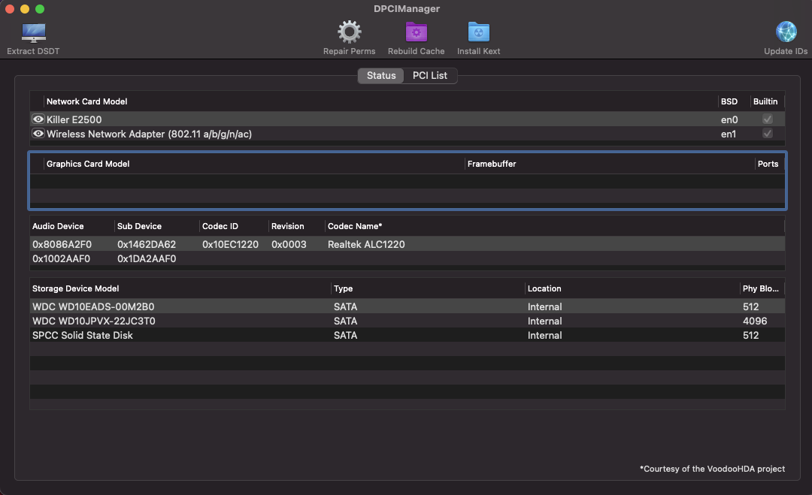
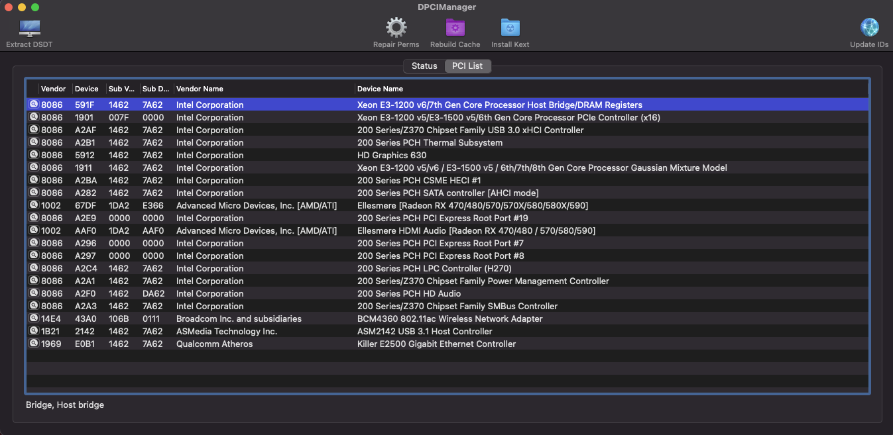
CPU Bench
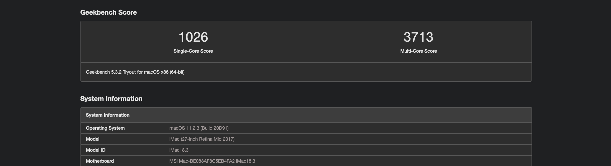
iGPU Bench
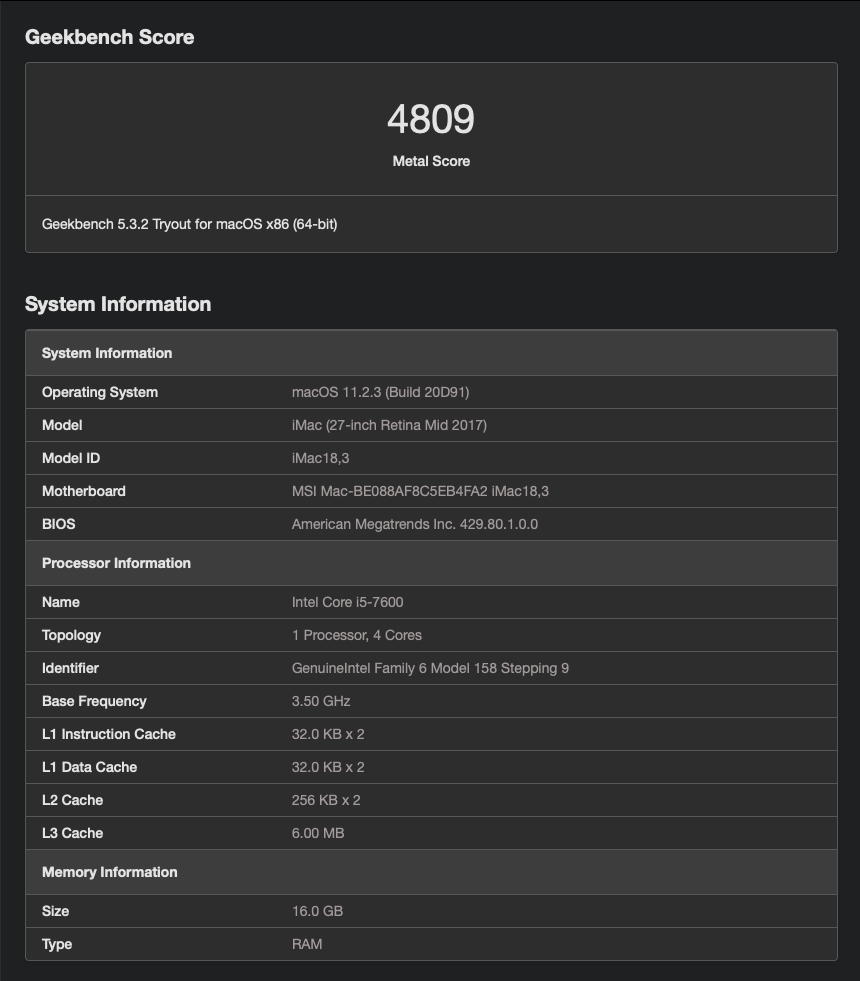
GPU RX 470/570 4g
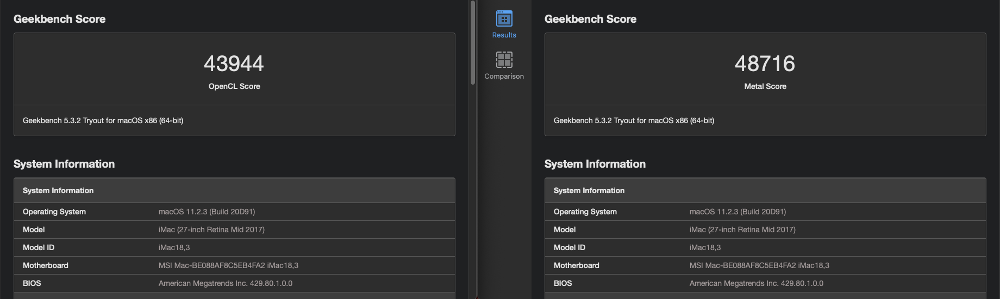
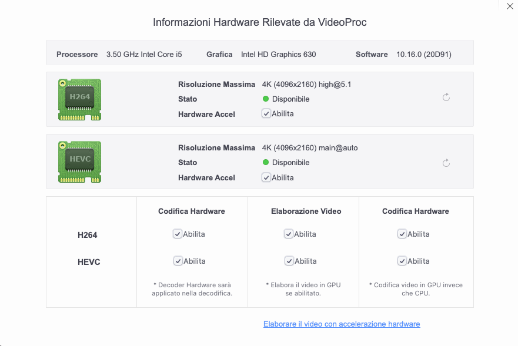

### Special Config:/Users/mario/Desktop/image

- USB port mapping performed
- VBios mod GPU, convert RX 470 4g Sapphire Nitro+ To RX 570 4g (increase performance) *

See [ioreg](https://github.com/Speeedo83/MSI-H270-RX470_mod_570-Hackintosh/blob/main/iMacLaboratorio.ioreg) for more clarification

### MacOS bootable USB creation:
- Read the Dortania guide for creating your USB from Windows or macOS
- [Guide Dortania](https://dortania.github.io/OpenCore-Install-Guide/installer-guide/) - USB creation

## BIOS Setting

* Load Optimize Default
* See and set

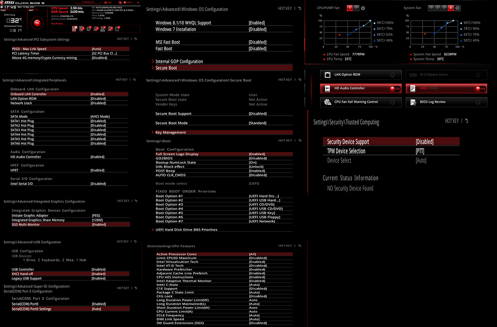

### Special VMod RX 470 4g To RX 570 4g Sapphire NItro+

DISCLAIMER!!!

This procedure involves risks for your GPU, I do not take any responsibility for it, I will limit myself only to describing.
It is recommended to run this in GPU with dual bios.

The mod in question and the relative Vbios is specific for the Sapphire Nitro+ RX 470 4g with elpida memories.

GUIDE:

Run windows and download this program: [GPU-Z](https://www.techpowerup.com/download/techpowerup-gpu-z/) by techpowerup and [ATIFlash](https://www.techpowerup.com/download/ati-atiflash/)

after the download, look at the manufacturer of the memories;
these can be elpida, micron, samsung or hynix, so as to download the most suitable V-Bios RX570 for your card for conversion. 

When you are sure, download the suitable V-Bios, in my specific case this:
[VBios](https://github.com/Speeedo83/MSI-H270-RX470_mod_570-Hackintosh/blob/main/VbiosMod/Sapphire.RX570.rom)

Unzip ATIFlash and copy the previously downloaded vbios into it.
At this point open the terminal as system administrator and go to the root of the ATIFlash folder and run the command:

amdvbflashWin -f -p 0 nomerom.rom

see pictures to simplify----------
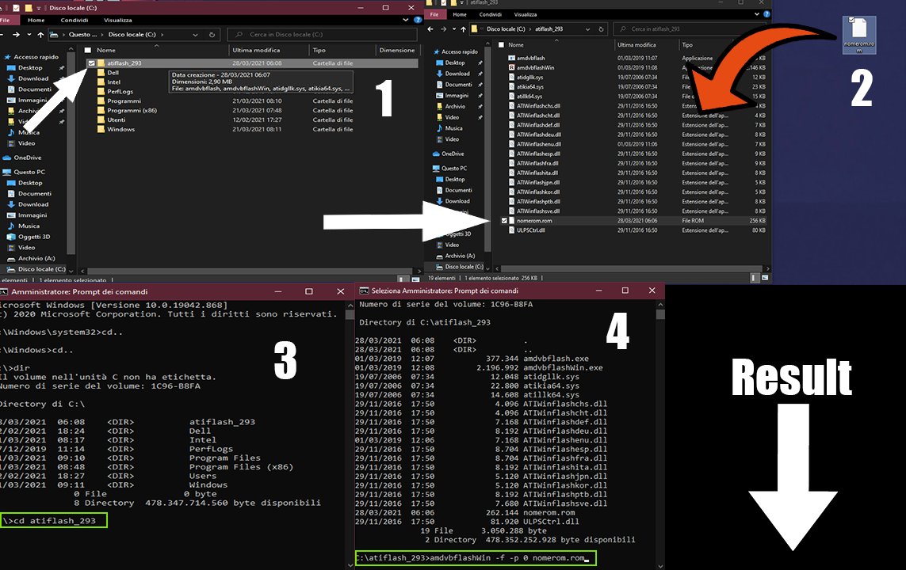
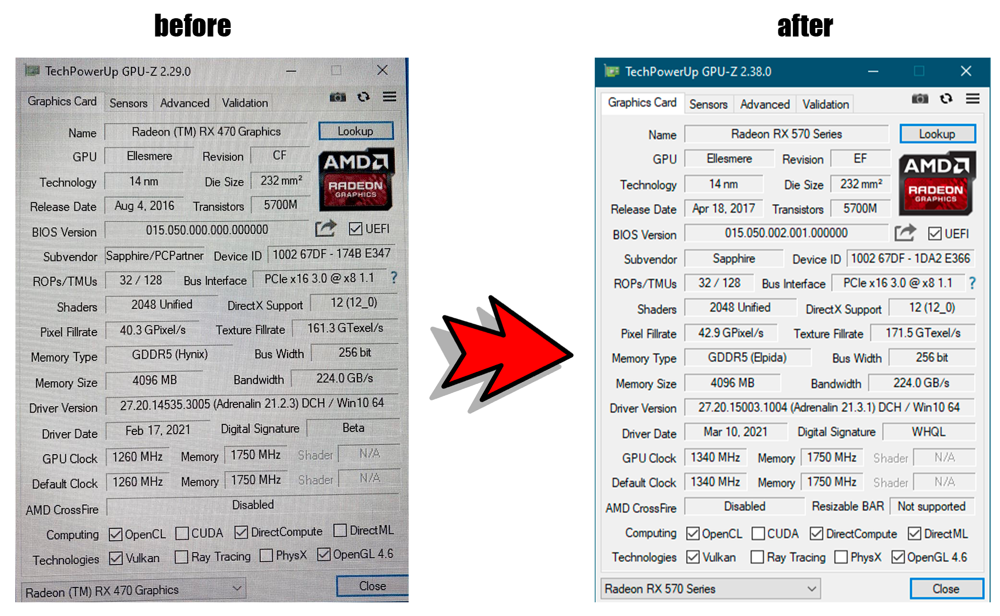

temperature and frequency

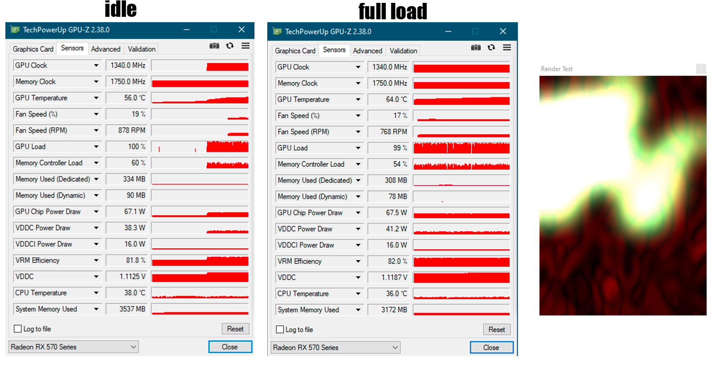
